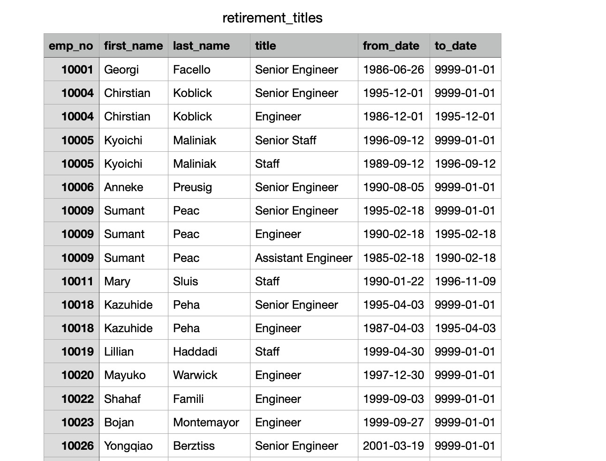
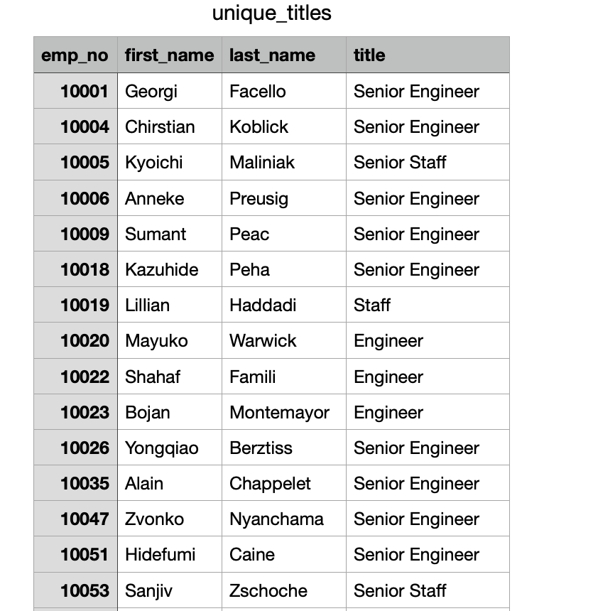
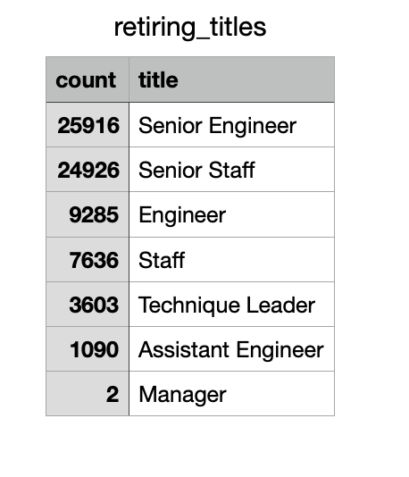
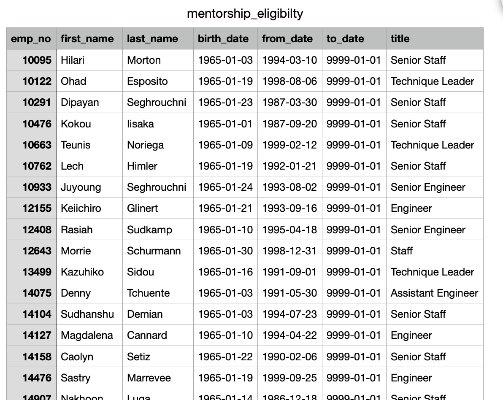

# Pewlett-Hackard-Analysis
## Background 
This project is for Pewlett Hackard to get a list of all the employees eligibale for retirement,which can decide the future requried filled positions.
## Result
1.  I create a table, which summarize all the potential employyees that can be retired:

However, There are duplicate entries for some employees because they have switched titles over the years
2.  I remove these duplicates and keep only the most recent title of each employee:

3. I retrieve the number of employees by their most recent job title who are about to retire:

4.  I create a Mentorship Eligibility table that holds the employees who are eligible to participate in a mentorship program:

## Summary
### How many roles will need to be filled as the "silver tsunami" begins to make an impact?
There are 72458 employees can retire soon and 1549 current emplees are eligible for the mentorship progrom, which mean 71,900s people who need to be filled as the "siliver tsunami" 
### Are there enough qualified, retirement-ready employees in the departments to mentor the next generation of Pewlett Hackard employees?
No enough, Pewlett Hackard need hire more people to fill the position
